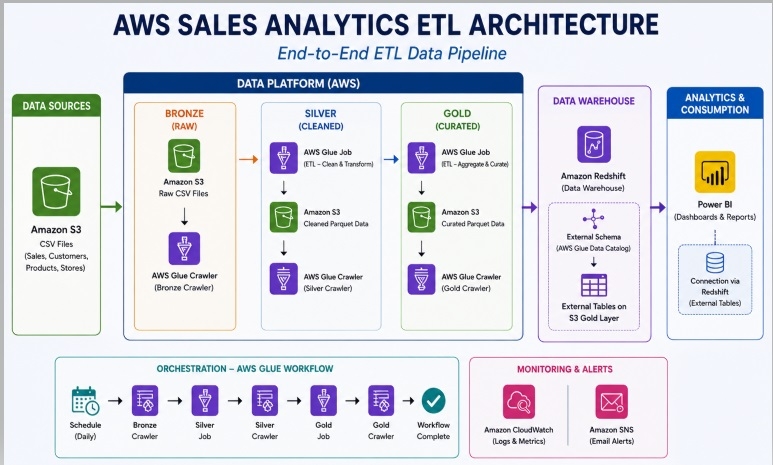

# End-to-End AWS ETL Pipeline using Medallion Architecture

### Project Overview

This project demonstrates the design and implementation of a scalable cloud-native ETL pipeline using AWS services. The solution follows the Medallion Architecture (Bronze → Silver → Gold) to transform raw sales data into analytics-ready datasets for business intelligence.
The pipeline automates data ingestion, cleansing, transformation, cataloging, and reporting while implementing incremental loading to minimize processing time and storage costs.

### Architecture

The pipeline consists of:
- Amazon S3
- AWS Glue Crawlers
- AWS Glue ETL Jobs
- AWS Glue Workflow
- AWS Glue Data Catalog
- Amazon Redshift Spectrum
- Microsoft Power BI
