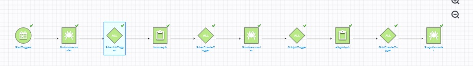
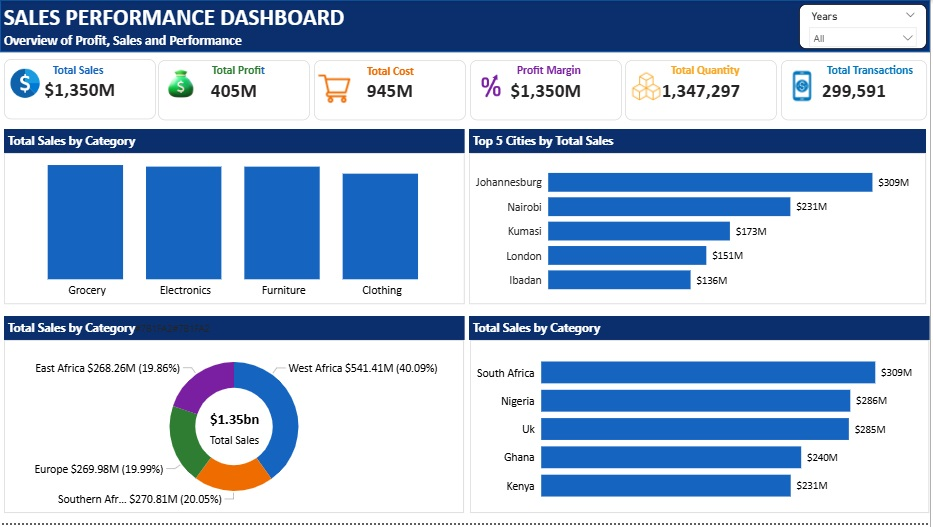

# End-to-End AWS ETL Pipeline using Medallion Architecture

### Project Overview

This project demonstrates the design and implementation of a scalable cloud-native ETL pipeline using AWS services. The solution follows the Medallion Architecture (Bronze → Silver → Gold) to transform raw sales data into analytics-ready datasets for business intelligence.
The pipeline automates data ingestion, cleansing, transformation, cataloging, and reporting while implementing incremental loading to minimize processing time and storage costs.

### Architecture

The pipeline consists of:
- Amazon S3
- AWS Glue Crawlers
- AWS Glue ETL Jobs
- AWS Glue Workflow
- AWS Glue Data Catalog
- Amazon Redshift Spectrum
- Microsoft Power BI

### Workflow

### Technologies Used
| Service	| Purpose |
|---------|---------|
| Amazon S3 | Data Lake |
| AWS Glue	| ETL Processing |
| PySpark	| Data Transformation |
| AWS Glue Crawlers |	Metadata Discovery |
| Glue Data Catalog	| Central Metadata Repository |
| AWS Glue Workflow |	Workflow Orchestration |
| Amazon Redshift Spectrum | SQL Analytics |
| Power BI	| Dashboard & Reporting  |

### Project Objectives
- Build an end-to-end ETL pipeline
- Implement Medallion Architecture
- Process only new records
- Reduce processing cost
- Automate the pipeline
- Build a dimensional model
- Produce analytics-ready datasets

#### Bronze Layer
Purpose: Store raw source files without modification.
Input
- Sales
- Customers
- Products
- Stores
Technology: Amazon S3

#### Silver Layer
Purpose: Clean and standardize raw data.
Transformations
- Trim whitespace
- Remove duplicates
- Validate business keys
- Handle missing values
- Convert dates
- Standardize categories
- Add partition columns
- Incremental loading using Left Anti Join
Technology: AWS Glue, PySpark

#### Gold Layer
Purpose: Build a Star Schema optimized for analytics.
Dimension Tables
- DimCustomer
- DimProduct
- DimStore
Fact Table
- FactSales

#### Incremental Loading Strategy
Instead of rebuilding the entire dataset during every execution, this project processes only new records.
Technique used: 
- Glue Job Bookmarks
- Left Anti Join
Benefits
- Faster execution
- Lower AWS costs
- No duplicate records
- Production-ready approach

#### Dashboard

### Business Value
This project demonstrates how modern cloud-native data engineering solutions can:
- automate data ingestion,
- improve data quality,
- reduce infrastructure costs,
- support scalable analytics
- provide reliable datasets for business intelligence.
